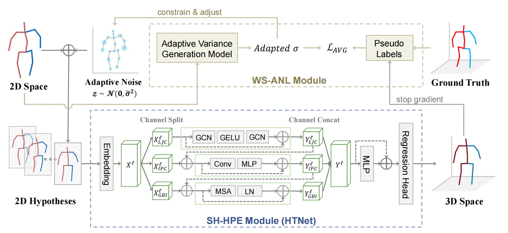

# Efficient 3D Human Pose Estimation with Adaptive Noise Sampling via Weakly Supervised Learning

## Introduction

Our proposed architecture consists of two main modules: 

a) **Weakly Supervised Adaptive Noise Learning Module(WS-ANL):** completes weakly supervised training of Adaptive Variance Generation Module; 

b) **Single-Hypothesis Human Pose Estimation Module (SH-HPE):** superimpose adaptive noise to the original 2D pose to generate multiple 2D hypotheses; map a single 2D pose to a 3D pose by an SH-HPE model (such as HTNet).



## Installation

Our work is tested on Ubuntu 22 with Pytorch 1.12 and Python 3.7.

```
pip install -r requirements.txt
```

## Dataset setup

Please download the dataset from [Human3.6M](http://vision.imar.ro/human3.6m/) and refer to [VideoPose3D](https://github.com/facebookresearch/VideoPose3D) to set up the Human3.6M dataset ('./dataset' directory). The 2D pose in the [MPI-INF-3DHP](https://vcai.mpi-inf.mpg.de/3dhp-dataset/) dataset was extracted using YOLOv3 and HRNet and you can download the processed data from [~~here~~](anonymous).

```
${POSE_ROOT}/
|-- dataset
|   |-- data_3d_h36m.npz
|   |-- data_3d_3dhp.npz
|   |-- data_2d_h36m_gt.npz
|   |-- data_2d_h36m_cpn_ft_h36m_dbb.npz
|   |-- data_2d_3dhp_gt.npz
|   |-- data_2d_3dhp_hrnet_coco.npz
```

## Evaluation

The pre-trained models can be downloaded from [~~Google Drive~~](anonymous). Put `ckpt` in the project root directory.

```
# Human3.6M
python main.py --shhpe_model "htnet" --sample_nums 200 --mutilhyp_test

# MPI-INF-3DHP
python main.py  --shhpe_model "htnet" --sample_nums 200 --mutilhyp_test --dataset '3dhp' -k 'hrnet_coco'
```

## Training

To train AVG model on Human3.6M:

```
python main.py --shhpe_model "htnet"  --train
```

## Citation

If you find our work useful in your research, please consider citing:

```

```

## Acknowledgement

Our code is extended from the following repositories. We thank the authors for releasing the codes.

- [VideoPose3D](https://github.com/facebookresearch/VideoPose3D)
- [GraphMLP](https://github.com/Vegetebird/GraphMLP)
- [Modulated-GCN](https://github.com/ZhimingZo/Modulated-GCN)
- [HTNet](https://github.com/vefalun/HTNet)


